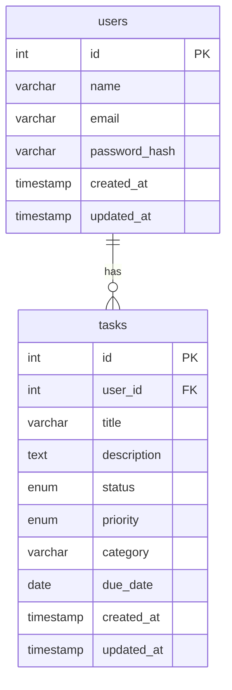

# Task Management API Documentation

## 1. README.md

```markdown
# Task Management API

A RESTful API for managing tasks with user authentication and authorization.

## Features

- User registration and authentication (JWT)
- CRUD operations for tasks
- Task prioritization and categorization
- Due date management
- Status tracking (todo, in-progress, done)
- Search and filtering capabilities
- Pagination support

## Quick Start

### Prerequisites

- Node.js v16+
- PostgreSQL v12+
- Docker (optional)

### Installation

```bash
git clone https://github.com/yourusername/task-management-api.git
cd task-management-api
npm install
```

### Environment Configuration

Copy `.env.example` to `.env` and update configuration values:

```env
PORT=3000
DB_HOST=localhost
DB_PORT=5432
DB_USER=postgres
DB_PASSWORD=yourpassword
DB_NAME=task_management
JWT_SECRET=your_jwt_secret
```

### Running Locally

```bash
npm run dev
```

The server will start on `http://localhost:3000`.

### Running Tests

```bash
npm test
```

### Deployment

See [DEPLOYMENT.md](./DEPLOYMENT.md) for production deployment instructions.
```

## 2. API_DOCUMENTATION.md

```markdown
# Task Management API Documentation

Base URL: `https://api.yourdomain.com/v1`

---

## Authentication

All protected endpoints require JWT authentication. Include token in Authorization header:

```
Authorization: Bearer <token>
```

### Login

**POST** `/auth/login`

Request body:
```json
{
  "email": "user@example.com",
  "password": "securepassword"
}
```

Response:
```json
{
  "accessToken": "jwt_token_here",
  "refreshToken": "refresh_token_here"
}
```

### Refresh Token

**POST** `/auth/refresh`

Headers:
```
Authorization: Bearer <refresh_token>
```

Response:
```json
{
  "accessToken": "new_jwt_token"
}
```

---

## Users

### Register User

**POST** `/users`

Request body:
```json
{
  "name": "John Doe",
  "email": "john@example.com",
  "password": "securepassword123"
}
```

Response:
```json
{
  "id": 1,
  "name": "John Doe",
  "email": "john@example.com",
  "createdAt": "2023-01-01T00:00:00Z"
}
```

### Get Current User

**GET** `/users/me`

Headers:
```
Authorization: Bearer <access_token>
```

Response:
```json
{
  "id": 1,
  "name": "John Doe",
  "email": "john@example.com",
  "createdAt": "2023-01-01T00:00:00Z"
}
```

---

## Tasks

### Create Task

**POST** `/tasks`

Headers:
```
Authorization: Bearer <access_token>
```

Request body:
```json
{
  "title": "Complete project proposal",
  "description": "Finish Q1 project proposal document",
  "dueDate": "2023-03-15",
  "priority": "high",
  "category": "work"
}
```

Response:
```json
{
  "id": 101,
  "userId": 1,
  "title": "Complete project proposal",
  "description": "Finish Q1 project proposal document",
  "status": "todo",
  "priority": "high",
  "category": "work",
  "dueDate": "2023-03-15",
  "createdAt": "2023-01-10T08:30:00Z",
  "updatedAt": "2023-01-10T08:30:00Z"
}
```

### Get Tasks

**GET** `/tasks`

Headers:
```
Authorization: Bearer <access_token>
```

Query parameters:
- `status`: Filter by status (todo, in-progress, done)
- `priority`: Filter by priority (low, medium, high)
- `category`: Filter by category
- `search`: Search in title/description
- `page`: Page number (default: 1)
- `limit`: Items per page (default: 20)

Response:
```json
{
  "data": [
    {
      "id": 101,
      "userId": 1,
      "title": "Complete project proposal",
      "description": "Finish Q1 project proposal document",
      "status": "todo",
      "priority": "high",
      "category": "work",
      "dueDate": "2023-03-15",
      "createdAt": "2023-01-10T08:30:00Z",
      "updatedAt": "2023-01-10T08:30:00Z"
    }
  ],
  "pagination": {
    "currentPage": 1,
    "totalPages": 1,
    "totalItems": 1,
    "limit": 20
  }
}
```

### Update Task

**PUT** `/tasks/:id`

Headers:
```
Authorization: Bearer <access_token>
```

Request body:
```json
{
  "status": "in-progress"
}
```

Response:
```json
{
  "id": 101,
  "userId": 1,
  "title": "Complete project proposal",
  "description": "Finish Q1 project proposal document",
  "status": "in-progress",
  "priority": "high",
  "category": "work",
  "dueDate": "2023-03-15",
  "createdAt": "2023-01-10T08:30:00Z",
  "updatedAt": "2023-01-11T09:15:00Z"
}
```

### Delete Task

**DELETE** `/tasks/:id`

Headers:
```
Authorization: Bearer <access_token>
```

Response:
```json
{
  "message": "Task deleted successfully"
}
```

---

## Error Codes

| HTTP Status | Error Code       | Description                          |
|-------------|------------------|--------------------------------------|
| 400         | BAD_REQUEST      | Invalid request data                 |
| 401         | UNAUTHORIZED     | Missing or invalid credentials       |
| 403         | FORBIDDEN        | Insufficient permissions             |
| 404         | NOT_FOUND        | Resource not found                   |
| 429         | TOO_MANY_REQUESTS| Rate limit exceeded                  |
| 500         | INTERNAL_ERROR   | Server error                         |

---

## Rate Limiting

- 100 requests per minute per IP
- 200 requests per minute per authenticated user
- Exceeding limits returns 429 Too Many Requests
```

## 3. ARCHITECTURE.md

```markdown
# System Architecture

## Overview

The Task Management API follows a layered architecture pattern with clear separation of concerns:

```
Client → Load Balancer → API Gateway → Application Servers → Database Cluster
```

## Components

### Frontend
- React/Vue/Angular client applications
- Mobile apps via REST API

### API Gateway
- Route management
- Rate limiting
- Authentication proxy
- CORS handling

### Application Layer
- Express.js server
- RESTful API controllers
- Business logic services
- Validation middleware

### Data Layer
- PostgreSQL database
- Redis for caching
- Sequelize ORM

### Infrastructure
- Docker containers
- Kubernetes orchestration
- Cloud provider (AWS/Azure/GCP)

## Database Schema



## Authentication Flow

1. User registers/login via `/auth/login`
2. Server validates credentials and issues JWT
3. Client stores JWT in localStorage/sessionStorage
4. Subsequent requests include JWT in Authorization header
5. Middleware verifies JWT and attaches user to request
6. Protected routes check user permissions

## Request Lifecycle

```
Client Request → 
  API Gateway (routing/rate limiting) → 
  Express Middleware Stack → 
    Auth Verification → 
    Input Validation → 
    Controller → 
    Service Layer → 
    Database Operations → 
  Response Formatting → 
Client Response
```

## Technology Choices

- **Node.js**: Event-driven, non-blocking I/O for high concurrency
- **Express.js**: Minimalist web framework with middleware ecosystem
- **PostgreSQL**: ACID-compliant relational database with JSONB support
- **Sequelize**: Promise-based ORM for type safety and query building
- **JWT**: Stateless authentication with short-lived tokens
- **Docker**: Containerization for consistent environments
- **Redis**: Caching layer for frequent queries
```

## 4. CONTRIBUTING.md

```markdown
# Contributing Guidelines

## Development Setup

1. Fork the repository
2. Clone your fork: `git clone https://github.com/yourusername/task-management-api.git`
3. Install dependencies: `npm install`
4. Create .env file from example: `cp .env.example .env`
5. Set up database: `npm run db:migrate`
6. Start development server: `npm run dev`

## Code Style Guide

- Use ESLint for JavaScript linting
- Follow Airbnb JavaScript Style Guide
- Use Prettier for code formatting
- Maintain 80-character line width
- Write meaningful commit messages

## Testing Requirements

All contributions must:
1. Pass existing tests
2. Add new tests for any new functionality
3. Maintain test coverage above 80%

Run tests: `npm test`

## Pull Request Process

1. Create feature branch: `git checkout -b feature/new-task-priority`
2. Make changes and commit with descriptive message
3. Push to your fork: `git push origin feature/new-task-priority`
4. Open pull request with:
   - Clear title
   - Detailed description
   - Related issue reference
   - Test results screenshot

## Review Criteria

- Code quality and readability
- Test coverage
- Performance implications
- Security considerations
- Documentation updates
```

## 5. DEPLOYMENT.md

```markdown
# Production Deployment

## Environment Setup

### Required Services

- Cloud provider account (AWS/Azure/GCP)
- Domain name with SSL certificate
- PostgreSQL database instance
- Redis cache instance
- CI/CD pipeline (GitHub Actions/CircleCI)

### Environment Variables

Production environment should have:

```env
NODE_ENV=production
PORT=80
DB_HOST=prod-db-host
DB_PORT=5432
DB_USER=prod-user
DB_PASSWORD=prod-password
DB_NAME=task_management_prod
JWT_SECRET=strong_production_secret
REDIS_URL=redis://cache-host:6379
LOG_LEVEL=info
```

## Database Setup

1. Create PostgreSQL database with proper sizing
2. Run migrations: `npm run db:migrate`
3. Configure connection pool settings
4. Set up regular backups
5. Enable monitoring alerts

## Monitoring Setup

### Logging

- Winston for structured logging
- Log aggregation (CloudWatch/Sentry)
- Error tracking integration

### Metrics

- Prometheus for system metrics
- Grafana dashboards for visualization
- Alerting thresholds:
  - CPU > 80% for 5 minutes
  - Memory > 90%
  - Error rate > 5%

### Health Checks

- Liveness probe: `/health`
- Readiness probe: database connectivity

## Scaling Considerations

### Horizontal Scaling

- Deploy multiple application instances behind load balancer
- Use sticky sessions if needed
- Scale based on:
  - CPU utilization (>70%)
  - Request latency (>500ms)
  - Queue length

### Database Scaling

- Read replicas for read-heavy workloads
- Connection pooling
- Index optimization
- Partitioning large tables

### Cache Strategy

- Redis for:
  - Frequent task lookups
  - Session storage
  - Rate limiting counters
- Cache invalidation strategy:
  - Time-based expiration
  - Event-driven updates

## Blue-Green Deployment

1. Deploy new version to green environment
2. Run smoke tests
3. Switch traffic from blue to green
4. Monitor for errors
5. Decommission blue environment after 24 hours
```

This comprehensive documentation covers all aspects of the Task Management API, providing developers, operators, and contributors with the necessary information to understand, use, and maintain the system effectively.